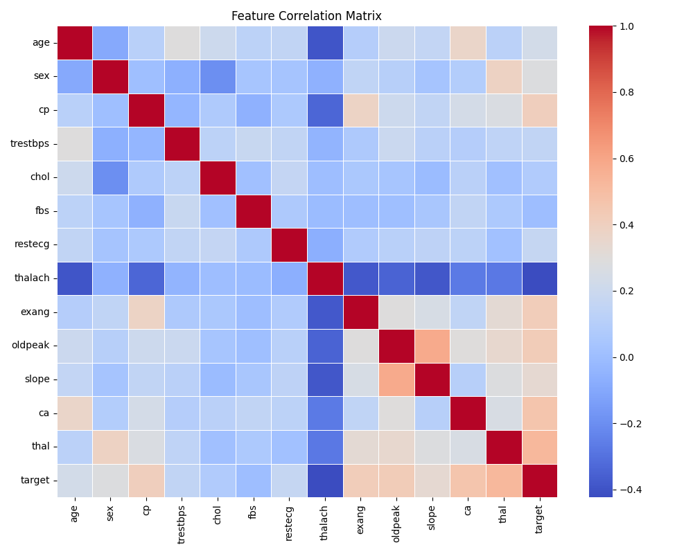
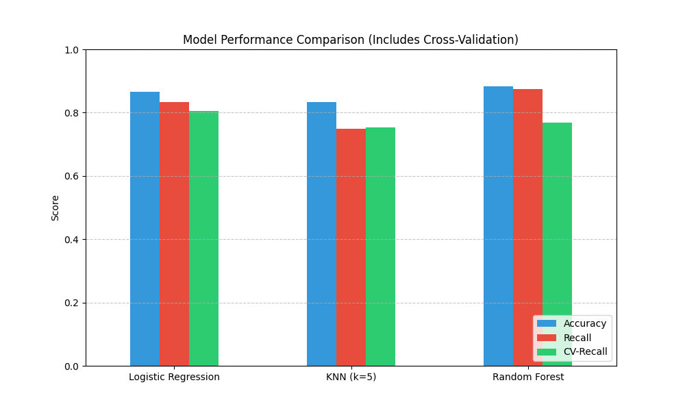
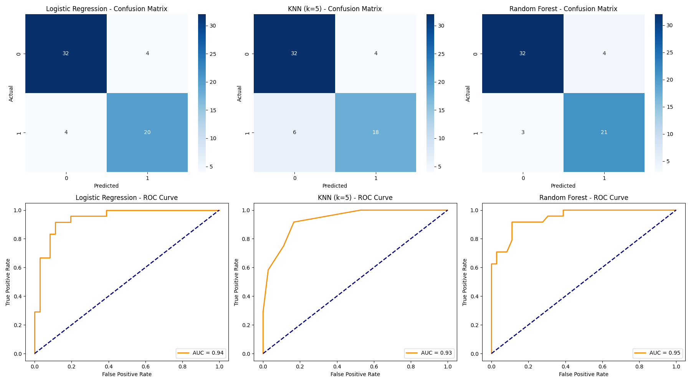

# Heart Disease Detection - Advanced Analysis

## 📌 Project Overview
This project presents an advanced approach to detecting heart disease using machine learning. The primary objective is to build and validate a robust classification model that can predict the presence of heart disease based on a set of clinical features.

This analysis goes beyond basic implementation by incorporating **Exploratory Data Analysis (EDA)**, robust **Cross-Validation**, and a detailed evaluation using **Confusion Matrices** and **ROC Curves** to select the most reliable model for a critical medical application.

## 📂 Data Source
- **Dataset:** Cleveland Heart Disease Dataset from the UCI Machine Learning Repository.
- **Source Link:** [UCI Heart Disease Data](https://archive.ics.uci.edu/ml/datasets/heart+disease)
- **Features:** 13 clinical attributes (age, sex, chest pain type, cholesterol, etc.).
- **Target:** A binary variable indicating the presence (1) or absence (0) of heart disease.

## ⚙️ Methodology

### 1. Exploratory Data Analysis (EDA)
To understand the underlying patterns in the data, a correlation matrix was generated. This heatmap visualizes the relationships between different clinical features and their correlation with the heart disease target variable.



### 2. Data Preprocessing
- **Data Cleaning:** Rows with missing values were removed to ensure data quality.
- **Target Transformation:** The target variable was converted into a binary format (0 for healthy, 1 for disease).
- **Feature Scaling:** `StandardScaler` was applied to normalize the feature set, a crucial step for distance-based and linear models.
- **Data Splitting:** The dataset was partitioned into an 80% training set and a 20% testing set.

### 3. Model Implementation & Validation
Three distinct classification algorithms were implemented:
1.  **Logistic Regression:** A robust linear model serving as a strong baseline.
2.  **K-Nearest Neighbors (KNN):** A non-parametric, instance-based model ($k=5$).
3.  **Random Forest:** A powerful ensemble model known for its high accuracy and robustness.

To ensure the models are not only accurate but also stable, their performance was validated using **5-Fold Cross-Validation** on the training data.

## 📊 Evaluation Metrics
For a medical diagnosis task, minimizing **False Negatives** (failing to detect a sick patient) is the top priority. Therefore, **Recall (Sensitivity)** was chosen as the primary evaluation metric. Additionally, **ROC-AUC Score** was used to assess the overall discriminative power of the models across all classification thresholds.

## 🏆 Results & Analysis

The models were trained and rigorously evaluated on the unseen test set. The results are summarized below.

### Performance Summary
The table below shows the key performance metrics. Random Forest demonstrated superior performance in both accuracy and the critical Recall metric.

| Model | Accuracy | Recall | CV Mean Recall | AUC Score |
|:---|:---:|:---:|:---:|:---:|
| Logistic Regression | 87% | 83% | 80% | 0.94 |
| K-Nearest Neighbors | 83% | 75% | 75% | 0.93 |
| **Random Forest (Best)** | **88%** | **88%** | **77%** | **0.95** |

### Visual Performance Comparison



### Detailed Error and ROC Analysis
The confusion matrices and ROC curves provide a deeper insight into each model's behavior.



### Key Findings:
1.  **Best Model:** **Random Forest** is the clear winner. It achieved the highest **Recall (88%)** and the highest **AUC score (0.95)**, making it the most reliable model for correctly identifying patients with heart disease.
2.  **Clinical Impact:** The Random Forest model correctly identified **21 out of 24** patients with heart disease in the test set, missing only **3** cases (False Negatives). In contrast, KNN missed 6 patients, making it unsuitable for this application.
3.  **Model Robustness:** While Random Forest excelled on the test set, Logistic Regression showed a slightly more stable Recall during 5-fold cross-validation (80% vs. 77%). However, the superior final performance of Random Forest on the unseen data makes it the recommended model for deployment.

## 🚀 How to Run the Project

### Prerequisites
Ensure you have Python 3.x installed. Then, install the required libraries:
```bash
pip install pandas numpy scikit-learn matplotlib seaborn
*You can also create a file named `requirements.txt` with the library names and run `pip install -r requirements.txt`.*

### Execution
1.  Clone this repository to your local machine.
2.  Navigate to the project directory and run the main script:
bash
python main.py
3.  The script will automatically download the data, train the models, and print the results to the console. It will also generate and save three image files in the project directory:
- `correlation_matrix.png`
- `model_comparison_pro.png`
- `advanced_analysis.png`

## 📚 References
1.  Detrano, R., et al. (1989). *International application of a new probability algorithm for the diagnosis of coronary artery disease.* American Journal of Cardiology.
2.  UCI Machine Learning Repository: Heart Disease Data Set.
3.  Scikit-Learn Official Documentation: [https://scikit-learn.org/](https://scikit-learn.org/).
